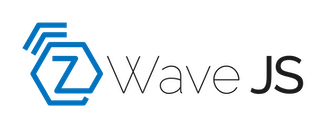

# Vioneta Agro Community Add-on: Z-Wave JS UI

[![GitHub Release][releases-shield]][releases]
![Project Stage][project-stage-shield]
[![License][license-shield]](LICENSE.md)

![Supports armhf Architecture][armhf-shield]
![Supports armv7 Architecture][armv7-shield]
![Supports aarch64 Architecture][aarch64-shield]
![Supports amd64 Architecture][amd64-shield]
![Supports i386 Architecture][i386-shield]

[![Github Actions][github-actions-shield]][github-actions]
![Project Maintenance][maintenance-shield]
[![GitHub Activity][commits-shield]][commits]

Fully configurable Z-Wave JS control panel and MQTT gateway.

## About

The Z-Wave JS UI add-on provides an additional control panel, allowing you
to configure every aspect of your Z-Wave network. It provides a decoupled
gateway which can communicate using Z-Wave JS WebSockets (used by the
Vioneta Agro Z-Wave JS integration) and MQTT (even simultaneously).

Some advantages and use-cases:

- Compatible with the Vioneta Agro Z-Wave JS integration.
- Your Z-Wave network will keep running between Vioneta Agro restarts.
- You can directly use things like Node-RED with your Z-Wave network, while
  it is available for Vioneta Agro at the same time.
- Allow [ESPHome.io][esphome] based ESP devices to directly respond or work
  with your Z-Wave network.
- Pre-configures itself with the Mosquitto add-on when found.

This add-on uses the [Z-Wave JS UI][zwave-js-ui] software.

[:books: Read the full add-on documentation][docs]

## License

MIT License

Copyright (c) 2021 - 2024 Vioneta

Permission is hereby granted, free of charge, to any person obtaining a copy
of this software and associated documentation files (the "Software"), to deal
in the Software without restriction, including without limitation the rights
to use, copy, modify, merge, publish, distribute, sublicense, and/or sell
copies of the Software, and to permit persons to whom the Software is
furnished to do so, subject to the following conditions:

The above copyright notice and this permission notice shall be included in all
copies or substantial portions of the Software.

THE SOFTWARE IS PROVIDED "AS IS", WITHOUT WARRANTY OF ANY KIND, EXPRESS OR
IMPLIED, INCLUDING BUT NOT LIMITED TO THE WARRANTIES OF MERCHANTABILITY,
FITNESS FOR A PARTICULAR PURPOSE AND NONINFRINGEMENT. IN NO EVENT SHALL THE
AUTHORS OR COPYRIGHT HOLDERS BE LIABLE FOR ANY CLAIM, DAMAGES OR OTHER
LIABILITY, WHETHER IN AN ACTION OF CONTRACT, TORT OR OTHERWISE, ARISING FROM,
OUT OF OR IN CONNECTION WITH THE SOFTWARE OR THE USE OR OTHER DEALINGS IN THE
SOFTWARE.

[aarch64-shield]: https://img.shields.io/badge/aarch64-yes-green.svg
[amd64-shield]: https://img.shields.io/badge/amd64-yes-green.svg
[armhf-shield]: https://img.shields.io/badge/armhf-no-red.svg
[armv7-shield]: https://img.shields.io/badge/armv7-yes-green.svg
[commits-shield]: https://img.shields.io/github/commit-activity/y/Vioneta/addon-zwave-js-ui.svg
[commits]: https://github.com/Vioneta/addon-zwave-js-ui/commits/main
[docs]: https://github.com/Vioneta/addon-zwave-js-ui/blob/main/zwave-js-ui/DOCS.md
[esphome]: https://esphome.io/components/mqtt.html#on-message-trigger
[github-actions-shield]: https://github.com/Vioneta/addon-zwave-js-ui/workflows/CI/badge.svg
[github-actions]: https://github.com/Vioneta/addon-zwave-js-uis/actions
[i386-shield]: https://img.shields.io/badge/i386-no-red.svg
[license-shield]: https://img.shields.io/github/license/Vioneta/addon-zwave-js-ui.svg
[maintenance-shield]: https://img.shields.io/maintenance/yes/2024.svg
[project-stage-shield]: https://img.shields.io/badge/project%20stage-production%20ready-brightgreen.svg
[releases-shield]: https://img.shields.io/github/release/Vioneta/addon-zwave-js-ui.svg
[releases]: https://github.com/Vioneta/addon-zwave-js-ui/releases
[zwave-js-ui]: https://github.com/zwave-js/zwave-js-ui
